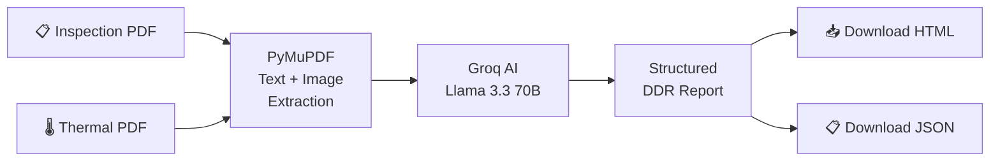

# 🔍 DDR Report Generator — AI-Powered Detailed Diagnostic Report System

> **AI Generalist Assignment** — An AI workflow that converts raw site inspection data into a structured, client-ready Detailed Diagnostic Report (DDR).

## 🏗️ Architecture

```
Python · Streamlit · PyMuPDF · Groq (Llama 3.3 70B)
```



## ✨ Features

| Feature | Description |
|---|---|
| **PDF Text Extraction** | Full-document text parsing via PyMuPDF — no truncation |
| **PDF Image Extraction** | Extracts all embedded photos from both PDFs |
| **Page Rendering** | Renders each PDF page as a high-quality image |
| **AI-Powered Analysis** | Groq Llama 3.3 70B merges inspection + thermal data |
| **7-Section DDR Output** | Property Summary, Area Observations, Root Causes, Severity, Actions, Notes, Missing Info |
| **Image Mapping** | AI maps extracted images to the correct area-wise observations |
| **Conflict Detection** | Flags when inspection and thermal data conflict |
| **"Not Available" Handling** | Explicitly calls out missing information per assignment rules |
| **Download HTML Report** | Standalone HTML report with embedded images (works offline) |
| **Download Raw JSON** | Machine-readable structured data export |

## 📸 Screenshots

### Full App — Generated DDR Report


> *The app showing both PDFs uploaded, the AI-generated DDR report with all 7 sections (Property Summary, Area Observations, Root Causes, Severity Assessment, Recommended Actions, Additional Notes, Missing Info), and download options for HTML & JSON.*

---

## 🚀 Quick Start

### 1. Install dependencies
```bash
pip install -r requirements.txt
```

### 2. Run the app
```bash
streamlit run app.py
```

### 3. Use the app
1. Get a **free Groq API key** from [console.groq.com/keys](https://console.groq.com/keys)
2. Enter your API key in the sidebar
3. Upload the **Inspection Report** PDF
4. Upload the **Thermal Report** PDF
5. Click **⚡ Generate DDR Report**
6. Download the report as HTML or JSON

## 📂 Project Structure

```
DDR REPORT GENERATOR FINAL/
├── app.py                          # Main Streamlit application (single file)
├── requirements.txt                # Python dependencies
├── README.md                       # This file
├── Sample Report.pdf               # Sample Inspection Report (input)
├── Thermal Images.pdf              # Sample Thermal Report (input)
├── Ai Generalist - Assignments.pdf # Assignment brief
├── Website sample Screenshots/     # App screenshots
└── HTML files/                     # Sample generated HTML report output
```

## 🛠️ Tech Stack

- **[Streamlit](https://streamlit.io/)** — Web UI framework for data apps
- **[PyMuPDF](https://pymupdf.readthedocs.io/)** — PDF text + image extraction
- **[Groq](https://groq.com/)** — Ultra-fast LLM inference (Llama 3.3 70B)
- **[Pillow](https://python-pillow.org/)** — Image processing

## 📝 How It Works

1. **PDF Parsing**: PyMuPDF opens both PDFs and extracts:
   - Full text content from every page
   - All embedded images (photos from inspections)
   - High-res page renders (critical for thermal images)

2. **AI Analysis**: The extracted text + image metadata is sent to Groq's Llama 3.3 70B model with a carefully designed prompt that:
   - Identifies area-wise observations
   - Maps inspection photos and thermal images to areas
   - Detects data conflicts between documents
   - Assesses severity with reasoning
   - Generates actionable recommendations

3. **Report Generation**: The AI's structured JSON response is rendered into:
   - A live Streamlit report with embedded images
   - A downloadable standalone HTML file
   - A raw JSON export

## ⚠️ Important Rules (per assignment)

- ✅ Does NOT invent facts — only uses document content
- ✅ Handles missing info → "Not Available"
- ✅ Handles conflicting data → describes the conflict
- ✅ Avoids duplicate observations
- ✅ Uses client-friendly language
- ✅ Generalises to similar reports (not hard-coded)
- ✅ Extracts and embeds images in appropriate sections

## 📜 License

Built for the AI Generalist Applied AI Builder Assignment.
